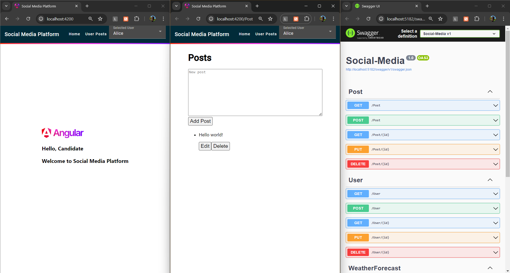

# Social Media Platform Assignment
<sub>Please thoroughly read the instructions before starting the assignment.</sub>
## Overview

You are tasked with developing a Social Media Platform that includes the following features:
- User engagement score calculation.
- Content moderation.
- User feed.

This assignment will help evaluate your skills in both backend and frontend development, focusing on programming logic and database management.

## Setting up the DotNet API

1. Open a terminal in the root directory (Where Program.cs file is)
2. Either run the command `dotnet run` or use any IDE (Visual Studio, vscode) to run the API

## Setting up the Angular application

1. Open a terminal and navigate to the `Social-Media-frontend` directory
2. Run the command `npm install` to install the dependencies
3. Run the command `ng serve` to start the Angular application

The application should now be running at `http://localhost:4200/`

## Functional Requirements

1. **User Engagement Score Calculation:**
   - Implement a function to calculate a user’s engagement score based on their activity (posts, likes, comments).
   - Show the engagement score of All Users on a Page and Sort them in Descending Order.
    - The engagement score is calculated as follows:
    `Engagement Score = (Number of Posts * 5) + (Number of Likes * 2) + (Number of Comments * 3)
    `

2. **Content Moderation:**
   - Implement logic to automatically flag inappropriate content based on a list of banned words.
    ```csharp
    var bannedWords = ["monolith", "spaghettiCode", "goto", "hack", "architrixs", "quickAndDirty", "cowboy", "yo", "globalVariable", "recursiveHell", "backdoor", "hotfix", "leakyAbstraction", "mockup", "singleton", "silverBullet", "technicalDebt"]
    ```
    - Provide feedback to users when their content is flagged when creating a post, or comment.
    - Do not allow the user to post the content if it contains any banned words.

3. **User Feed**
   - Show a feed page with a list of posts, likes, and comments from all users.

## Non-Functional Requirements

1. **Data Consistency and Integrity:**
   - Ensure data is accurate and consistent.

2. **Code Quality:**
   - Write clean, readable, and maintainable code following best practices.

3. **Testing:** (Optional)
   - Include unit tests to verify the functionality of the application.


## Database Schema

Here is the SQLite schema for the Social Media Platform:

```sql
CREATE TABLE Users (
    UserID INTEGER PRIMARY KEY,
    UserName TEXT NOT NULL
);

CREATE TABLE Posts (
    PostID INTEGER PRIMARY KEY,
    UserID INTEGER,
    Content TEXT NOT NULL,
);

CREATE TABLE Likes (
    LikeID INTEGER PRIMARY KEY,
    UserID INTEGER,
    PostID INTEGER,
);

CREATE TABLE Comments (
    CommentID INTEGER PRIMARY KEY,
    UserID INTEGER,
    PostID INTEGER,
    Content TEXT NOT NULL,
);
```

A SQLite database file `SQLLiteDatabase.db` is included in the project with some sample data.
You can view the database using a SQLite plugin in IDE or any other tool of your choice.

### .NET Web API

- Implement controllers for managing users, posts, likes, and comments.
- Should include basic CRUD operations and custom endpoints for specific functionalities.
- Add Services for Talking to the SQLite Database

An Example `PostController` and `PostService` are Already Made for You.


### Angular Frontend
- Show Feed Page with a list of posts, likes, and comments from All Users. `UserFeedComponent`
  The Feed Page should show the following:
    - Posts with the User's Name and Content
    - Likes with the User's Name and Post's Content
    - Comments with the User's Name and Post's Content
  Functionality:
    - Like a Different User's Post
    - Comment on a Different User's Post
    - Content Moderation: Show a Message if the Comment being made contains any Banned Words
- Show User Engagement Score Page with a list of Users and their Engagement Scores. `UserEngagementComponent`
  Functionality:
    - Show the User's Name and Engagement Score
    - Sort the Users in Descending Order of Engagement Score
- Show Page for Creating, Editing, and Deleting Posts for the Current User. `PostListComponent`
  Functionality:
    - Create a Post
    - Content Moderation: Show a Message if the Post being made contains any Banned Words
    - Edit a Post
    - Delete a Post
- Create Services for Talking to the .NET Web API
- Make Simplistic User Interface for the Social Media Platform (You can use Angular Material for this, or any other UI Library of your choice or even plain CSS)
- Make Additional Components and Services as Needed.
An Example `PostListComponent` and `PostService` are Already Made for You with some functionality.


## Example Flow
- User Engagement Score Calculation:
Calculate and display the engagement score for each user based on their activity (posts, likes, comments).

- Content Moderation:
Flag inappropriate content automatically and provide feedback to users.

- User Feed:
Generate and display a Feed for user interactions, including the number of posts, comments, likes received, and given.


## Troubleshooting

If you run into issues while setting up solution, try the following:
- Either run the command `dotnet run` or use any IDE (Visual Studio, vscode) to run the API
- Run the command `ng serve` to start the Angular application inside the `Social-Media-frontend` folder, after installing the necessary packages through `npm`
- If you are unable to set up the angular application, you can use the tools like postman or curl to test the API and Complete Half of the Assignment
- Make sure you have the latest versions of .Net 7 SDK, Node.js, and npm installed, appropriate Angular version.
- Check that the API is running and accessible at `http://localhost:5182/swagger/index.html`, or the appropriate port if you have changed it.
- If you get a CORS error, make sure that the correct origins are allowed in the API

> Please note that you should not make Pull Requests to this repository or Fork it. You should clone this repository and work on your own repository. Submissions will be made through a Form that will be shared with you.

> You should not share your code with anyone else or make it public. This is to ensure that all submissions are original work.

> If you have any questions or need clarification, please reach out to the person who shared this assignment with you.

> Include Snapshots of the Application Running in the README.md file of your Repository and any additional information you would like to share.

> Good Luck! 🚀
